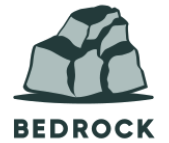

# bedrock

Starting point for REST service

## Features

* ZIO HTTP REST endpoints
* Injectable data store (allows for unit testing w/o real database)
* Switchable Swagger support for prod/non-prod. 
    Compile with: ```sbt -Dprod=true "clean;compile;package;assembly"``` to disable Swagger for production deployment
* Test examples -- how to test a REST service
* [HTTPS Support](docs/https.md)
* [Auth using tokens (endpoint protection) incl rotating keys and tokens)](docs/security.md)
* Get access to the encoded user id from jtw token in handler
* LocalStack support for running locally and integration testing
* Bedrock Auth (OAuth-lite) including:
  - Token rotation/expiration
  - Session (refresh) tokens
  - Role-based endpoint protection


IN-PROGRESS:
* Move AWS scripts to terraform
* Figure out OAuth
   -- Get web-based OAuth working
   -- Get Mobile/SPA/machine-2-machine working (different flow? AJAX?)
* Figure out config w/env vars that override, eg IS_LIVE to know if we're running live or locally


DEPLOYMENT/AWS:
* Configure logback to send logs to CloudWatch. May need templated config files to do this.


TODO:
* Implement true session cache with Elasticache+Redis (requires upgrade to Localstack Pro)
* Auto-generate Swagger config (fixed with my own mods to ZIO HTTP...PR pending)
* Hide server.crt/server.key files but ensure they're published & packaged correctly
* Figure out packaging (Docker, versioning, deployment, local/AWS)
* Figure out Kuberneties
* Figure out Terraform
   -- Using TF to replace all the AWS CLI commands I use with LocalStack (there won't be LocalStack obviously in AWS)
   -- Configure multiple environments with different TF specs: dev, test, stage, prod
   -- Configure github workflows manually trigger deployments to different envs
   -- Figure out AWS permissioning so a low-level dev can't deploy to prod but a sr-dev could
* Figure out monitoring
* Figure out advanced logging (eg with queries like splunk)
* Investingate queryable event queue
* Integrate w/RDS

## Running

Be sure you've got Docker running on your local host and that you've run ```sbt docker:publishLocal```
to create a Docker container for Bedrock.  Then you can run the following to launch LocalStack (AWD simulator)
and Bedrock:
```
docker-compose up
```

Stopping:
```
docker-compose down
```