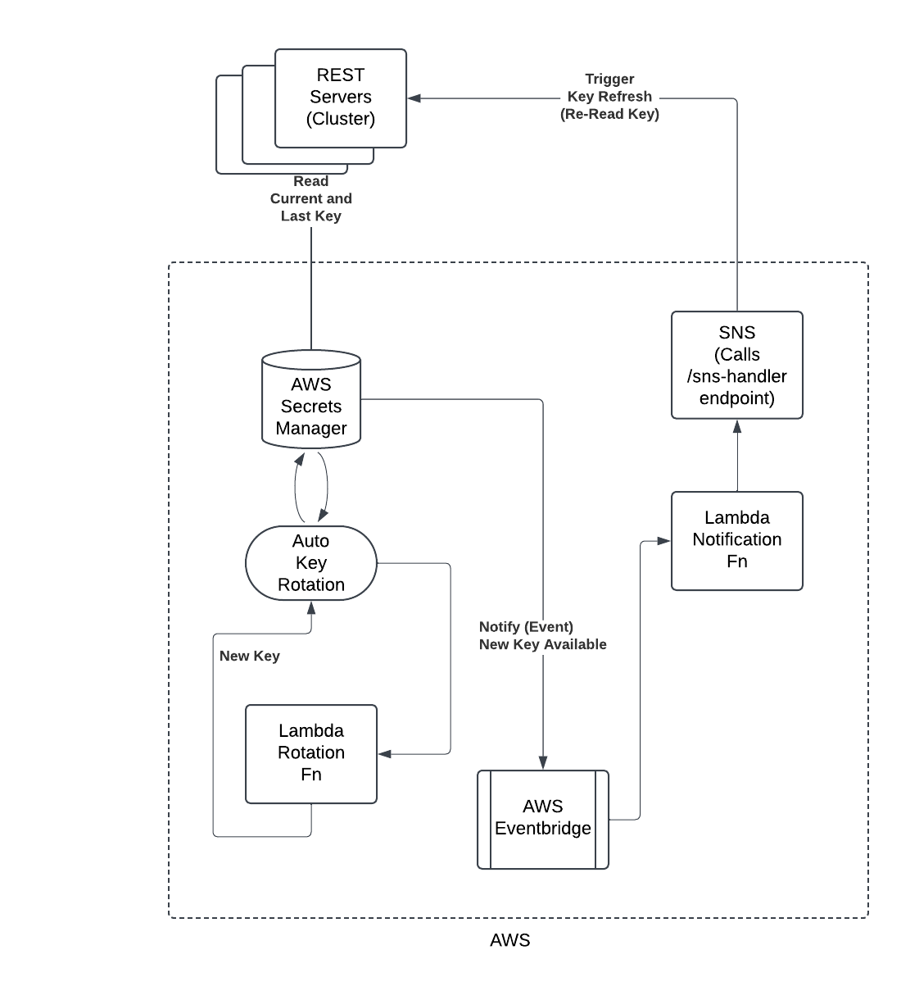

# REST Security

There are 3 pieces of security protecting a REST call:

1) HTTPS - this encrypts the communication between client and server
2) Bearer Token - Must have a token in order to call an endpoint. Should be rotated periodically
3) Secret Key - This key is used to generate the Bearer Token. Should be rotated periodically

HTTPS is described here: [HTTPS Support](docs/https.md)

## Bearer Tokens
A Bearer Token is string payload encrypted with an algorithm using a Secret Key, 
described below. When you design your REST APIs you will choose those you want protected,
for example behind a user login, vs those that are "open" (anyone can call them). This means any 
caller without a Bearer Token, or an expired token, will experience a failure upon calling a REST endpoint.

Bearer Tokens have a configurable expiry (application.conf). The expiration is a balance between usability 
and security.  Short expirations are more secure but mean that a relatively brief period of inactivity will log 
out a users. However a short expiration also means an attacker who somehow has gained access to a Bearer 
Token has very little to take advantage of his prize before it expires. This framework uses a default of 7 minutes
for Bearer Token Expiration. Bearer Token regeneration is an important way to seamlessly try to keep valid 
users logged in while also maintaining short token expiry. We will cover that subject after discussing Secret Keys.

## Secret Keys
Secret Keys can be any string value. In the sample (local) framework we just use a simple string, however
it actual production use a random string value would be ideal, for example a random UUID. The Secret Key
is used to encrypt the Bearer Tokens. Secret Keys should likewise be rotated periodically. The greater the 
security level the more frequent the rotation cadence, however rotation frequency of Secret Keys will be 
much less than the rotation frequency of Bearer Tokens.

One challenge we immediately face with Secret Keys is how they can be used in a scaled, distributed environment.
Our REST servers will be deployed as clusters of containers running on the cloud (AWS presumed). They all need
access to the Secret Key, and they will all need access to any rotated key values. We need a central repository
for Secret Keys.

Fortunately AWS provides a Secrets Manager service. We can use a Java client to access Secret Keys stored
in Secrets Manager across all our clustered REST servers. The mechanism provided by Bedrock for key rotation
is described below.

## Secret Key Rotation
Secret Keys, like Bearer Tokens, should be rotated on some regular cadence. AWS Secrets Manager provides a built-in 
facility for auto-rotation with configurable cadence. For a secure environment some guidelines suggest rotating keys 
every 30-90 days. Your environment may have regulations that stipulate the frequency, otherwise use your own
judgement.

The diagram below shows how key rotation would work in AWS:



>NOTE: All The AWS services, lambda functions, etc. must be configured by you in AWS. They are not automatically provided by the Bedrock framework, but are presumed to be present.

There are a number of moving pieces here. When Secrets Manager triggers key rotation, a lambda function you
provide will be kicked off. We suggest a simple function that just creates a new random UUID string, but it can
be whatever you want, or regulations require. The new key is then Stored in Secrets Manager, which versions
the keys (this is important!). AWS Eventbridge can be used to trigger an event that a new key is available. 
EventBridge will be configured to use another lambda function to detect all running instances of your clustered
servers, get their IPs, and use SNS to call the /rotate-secret endpoint, which will trigger each instance to 
reload the current and previous secret keys from AWS Secrets Manager..

>NOTE: The /rotate-secret endpoint is "open", ie not protected by auth token. You will need to configure
>AWS to protect that endpoint to only allow access from SNS.

There's a big "but..." here. Communication of the new key to all the clustered instances is not instantaneous.  There 
are two cases we must consider and develop strategies to handle during the window of time allowed for all servers
to receive the /rotate-secret message and we have a mix of old/new secrets out there:

1. Server has updated their Secret Key but receives a valid and non-expired token generated with the old Secret Key
In this case we track the previous Secret Key and try to decode with it--but only during the "grandfather" window,
set in application.conf: old_token_grandfather_period_sec. During this window the server will accept a valid
and non-expired "old" token. A new token will be generated with the new Secret Key and returned in the
Authorization header of the Response. (The client is responsible to track the changed token and use it in
following REST calls.)

2. Server has not received, or missed, the /rotate-secret message, and receives a token using the new Secret Key 
In this case the Server does nothing but log the occurrence and return Unauthorized. Why? Because neither the
current nor previous Secret Keys will work. Trying to guess whether to update the keys is likewise a losing game
because the Server has no way to know whether this presented token is valid-but-new, or expired, or invalid.

For case 2, we have a problem.  The strategy here doesn't not really address the problem. The solution needs
to happen in the cloud, in AWS. We will need a custodian lambda function that triggers on a cadence, say 3
or 4 times a day, and gets a list of all running server instances and diff's it with a list of all SNS-subscribed
servers on the key rotation notification topic.  Any servers not subscribed to SNS should be terminated;
Kubernetes will restart them if needed. Any servers in the SNS subscription list which are not running should
be un-subscribed by the lamda function. This dual-diff strategy should maintain reasonable cleanliness of the
subscription stack. Further we can link an alert trigger to the logs when we get a message saying that a server
may have missed the notification. Case 2 should by far be the more improbable of the two.

## Bearer Token Rotation
Bearer Token rotation (regeneration) is required on all REST endpoints for security. The login process
creates the initial bearer token, which expires after so many minutes of inactivity (defaults
to 7 min in this framework). During normal use, we want this token to be regenerated before it expires,
again for security. If someone manages to obtain the bearer token they have <10 min to figure
out how to benefit from that knowledge before the token refreshes and is therefore invalid.

We don't want active users making regular API calls to be logged out when the token expires, so we want to
regenerate a new token when the user's API call happens within a configurable window.  For example,
if tokens expire in 10 minutes we can regenerate a new token if the user makes an API call within 5 minutes
of expiration.  Choosing the right regen window is an inexact science. On one extreme you could 
regenerate a new token upon every API call. That adds overhead to every request but users will never
be logged out prematurely.  This strategy avoids a lot of mess where the user can be prematurely logged
out even though they have not been inactive for the entire time.  The actual timeout is 10 minutes,
but we tell users the timeout is 5. This eliminates any overlap in timeout with the auto regen window.
This is pretty secure for most standard business applications; 10 minutes is not a lot of time.

If this strategy is insufficient you have 2 options. You could eliminate the window altogether, ie set
the regen threshold equal to the timeout ensuring token rotation upon every call. This is extreme,
and has overhead, but is very secure, for example for a banking application.  Otherwise you could set
a reasonable window, say 2 minutes, for token rotation.  This does leave open some possibility users
may be logged out/expired even though they were not inactive for 10 minutes.  No perfect answer
here--pick your poison based on need.	

## Tips  

Update secret key in Secrets Manager from command line:

```
> aws secretsmanager --endpoint-url=http://localhost:4566 update-secret --secret-id MySecretKey --secret-string "foo"
```

This creates a new version of a key. You can use the Java API to get old versions of a key and look for the two
labeled AWSCURRENT and AWSPREVIOUS. Those are the two you want to ingest to handle the "split version"
problem during the rotation window when old and new keys may be in force at the same time.